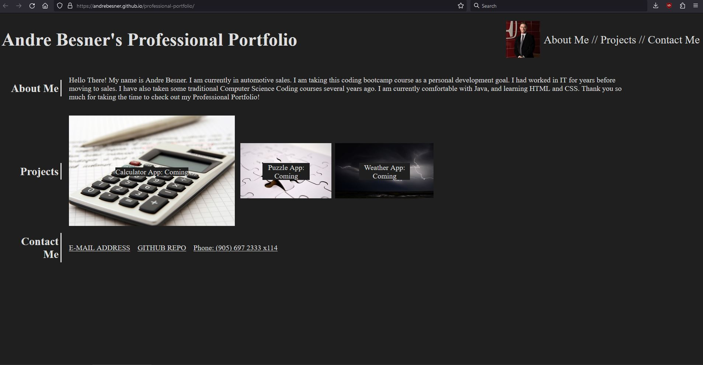

# professional-portfolio
Currently Challenge 2 for bootcamp

## Description

This is a website built by Andre Besner with help from mutiple wonderful amazing contributors.

The goal of this website is to showcase projects Andre has deployed throughout his web-development career.

This site will be updated and new projects are started, about me's and contact me's live here as well. This information will be as up to date as possible

## Installation

No installation required, just go to https://andrebesner.github.io/professional-portfolio/

Tested with Chrome and Firefox

## Usage

No specific usage, just navigate as normal site.

Use hotlinks at top for quick access to about me, project, and contact me section

Clicking email will open default email app, right click to copy email

## Credits

Resources Used 

https://www.smashingmagazine.com/2018/08/flexbox-alignment/

https://developer.mozilla.org/en-US/docs/Web/CSS/CSS_Flexible_Box_Layout/Aligning_Items_in_a_Flex_Container

https://pixabay.com/

https://www.w3schools.com/

https://blog.logrocket.com/responsive-image-gallery-css-flexbox/

https://www.w3docs.com/snippets/html/how-to-create-an-anchor-link-to-jump-to-a-specific-part-of-a-page.html

Super special thanks to 
https://stackoverflow.com/questions/41789278/first-child-full-width-in-flexbox

Daler Singh - BootCamp Instructor

Adam Nyx - BootCamp Instructor

http://meyerweb.com/eric/tools/css/reset/ 
v2.0 | 20110126
License: none (public domain)

## License

MIT License

Copyright (c) 2023 Andre Besner

Permission is hereby granted, free of charge, to any person obtaining a copy
of this software and associated documentation files (the "Software"), to deal
in the Software without restriction, including without limitation the rights
to use, copy, modify, merge, publish, distribute, sublicense, and/or sell
copies of the Software, and to permit persons to whom the Software is
furnished to do so, subject to the following conditions:

The above copyright notice and this permission notice shall be included in all
copies or substantial portions of the Software.

THE SOFTWARE IS PROVIDED "AS IS", WITHOUT WARRANTY OF ANY KIND, EXPRESS OR
IMPLIED, INCLUDING BUT NOT LIMITED TO THE WARRANTIES OF MERCHANTABILITY,
FITNESS FOR A PARTICULAR PURPOSE AND NONINFRINGEMENT. IN NO EVENT SHALL THE
AUTHORS OR COPYRIGHT HOLDERS BE LIABLE FOR ANY CLAIM, DAMAGES OR OTHER
LIABILITY, WHETHER IN AN ACTION OF CONTRACT, TORT OR OTHERWISE, ARISING FROM,
OUT OF OR IN CONNECTION WITH THE SOFTWARE OR THE USE OR OTHER DEALINGS IN THE
SOFTWARE.

http://meyerweb.com/eric/tools/css/reset/ 
v2.0 | 20110126
License: none (public domain)
